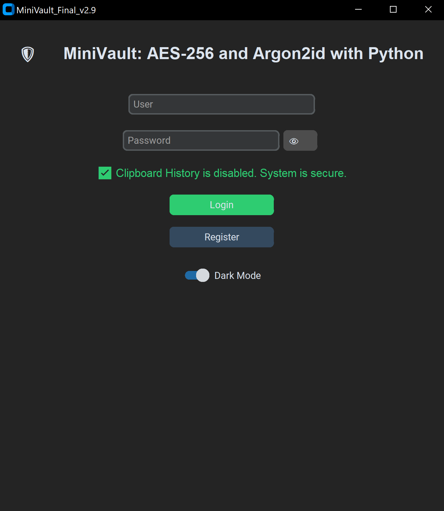
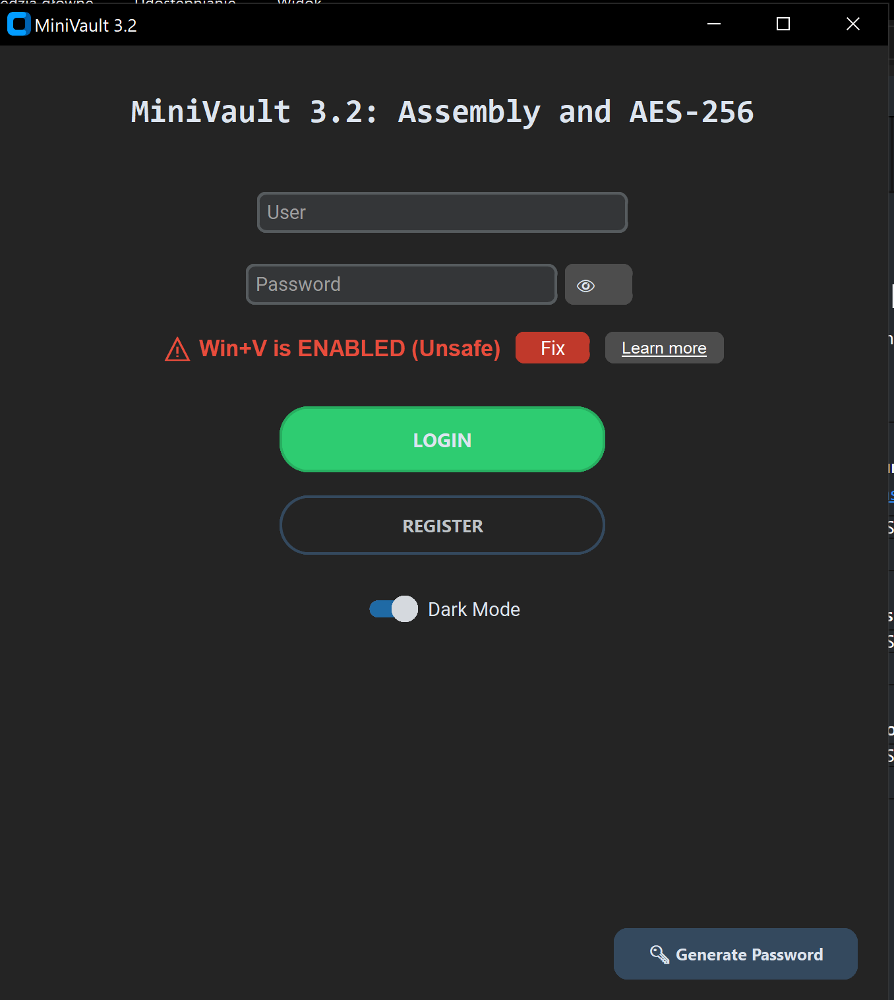

# 🛡️ MiniVault v3.2 | Encryption Engine

**MiniVault** is a security tool engineered for mission-critical.

---

## 💎 Technical Excellence

### 🔑 Cryptographic Core

- **Argon2id Key Derivation:** Configured with a **1.0 GB Memory Cost** and high iteration count. This ensures maximum resistance against GPU/ASIC-based brute-force attacks and "Time-Memory Trade-Off" (TMTO) exploits.
- **AES-256 GCM (Galois/Counter Mode):** Military-grade symmetric encryption providing both confidentiality and data authenticity (Authenticated Encryption).
- **Hardware Acceleration:** Native support for **Intel® AES-NI** instruction sets, enabling wire-speed encryption directly on the silicon level.

### 🧠 Advanced Memory Management

- **Memory-Hard Security:** The 1 GB RAM allocation during key derivation creates a "Secure Sandbox" that protects against unauthorized memory scraping during the transformation phase.
- **Clipboard Sanitization:** Real-time monitoring and purging of Windows Clipboard (including Win+V history) to prevent sensitive data leakage.

---

## 💻 System Requirements

To maintain the integrity of the 1 GB Argon2id derivation process:
- **Storage:** HDD SATA, 65 MB
- **Processor:** Intel Core i5-6200U
- **Memory:** 8 GB Dual-Channell LPDDR3.
- **OS:** Windows 10/11 64-bit

## Recommended Specifications (Optimal Performance)
*   **CPU:** Intel Core i7-7560U or higher
*   **RAM:** 16 GB Dual-Channel LPDDR3
*   **Storage:** NVMe M.2 SSD (PCIe Gen3 or higher) 100 MB

---

## 📜 Legal & Compliance

- **Privacy:** No telemetry, no cloud-sync. Your keys never leave your RAM.

---
